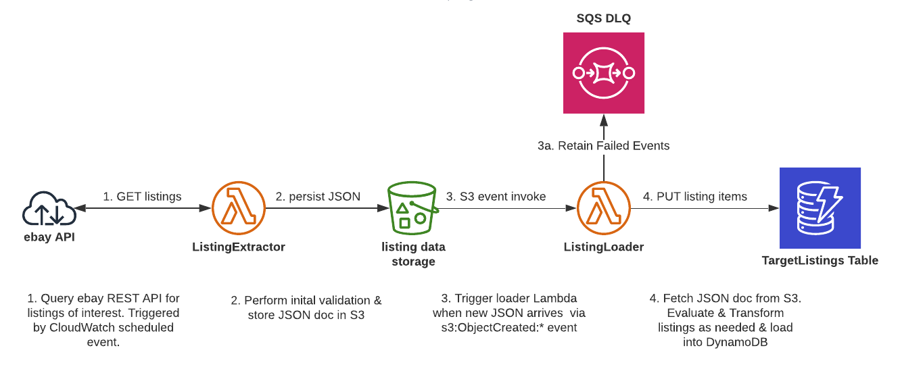

# ebay Tracker

AWS SAM based microservice that pulls ebay listing data on a CRON schedule. Listing data
is then evaluated and stored in DynamoDB.





## CI/CD

The app for multiple environments is deployed automatically upon a code merge to the `dev` or `master` branch for the `dev` and `prod` environments respectively.

The deployment pipelines are handled by AWS CodePipeline while the code is validated, tested, built and deployed
via AWS CodeBuild and SAM/CloudFormation.

## Templates

### template.yaml
A SAM template that defines the application's AWS resources.

### pipeline.yaml
A CloudFormation template that defines the deployment pipeline (CodePipeline & CodeBuild project) and related resources.

#### Deployment example

```bash
aws cloudformation create-stack \
--profile default \
--region us-east-1 \
--capabilities CAPABILITY_IAM \
--stack-name ebay-tracker-pipeline-prod \
--template-body file://pipeline.yaml \
--parameters ParameterKey=GitHubRepo,ParameterValue=ebay-tracker \
ParameterKey=Environment,ParameterValue=prod \
ParameterKey=GitHubOwner,ParameterValue=github-username \
ParameterKey=GitHubToken,ParameterValue=[TOKEN-HERE] \
ParameterKey=DeployPullRequests,ParameterValue=true
```

### Makefile
A Makefile is provided in the project root directory and is used to run commands during local development and deployment.

Default environment variables used by the Makefile can be overwritten by creating a `Makefile.env` file as shown below. This file is **OPTIONAL** and should **NOT** be committed into version control.

```bash
AWS_PROFILE = default
SAM_ARTIFACT_BUCKET = my-bucket
SAM_STACK_NAME = ebay-tracker
LAMBDA_NAME = ListingLoader
LAMBDA_EVENT = events/event-s3.json
...
```

**Usage Examples**
```bash
make test
```

| Command   | Description |
| --------- | ----------- |
| help      | Describe all available commands |
| npmi   | Install npm dependencies |
| test      | Run code linter, unit tests and code coverage report |
| invoke    | Invoke an individual Lambda function |
| lint      | Run code linter |
| coverage  | Run unit tests & coverage report |
| unit      | Run unit tests |
| clean     | Delete local artifacts |
| deploy     |  Deploy SAM app using local code |


## App Development

### Folder Structure

| Folder        | Purpose       |
| ------------- |:-------------:|
|/src | Source code |
|/__tests__ | Test related files |
|/template.yaml | SAM CloudFormation Template |
|/pipeline.yaml | CICD CloudFormation Template |
|/Makefile | executes local dev & CICD commands |
|/Makefile.env | optional local env var overrides |

### Development Flow
1. Create a feature branch
2. Add AWS resources as needed to template.yaml (eg. Lambda, DynamoDB, etc.)
3. Add supporting Lambda code under src/functions
4. Add test coverage and run `make` or `make test`
5. Create a Pull Request & verify build passes
6. Deploy by merging into the appropriate branch (eg. dev, master)
